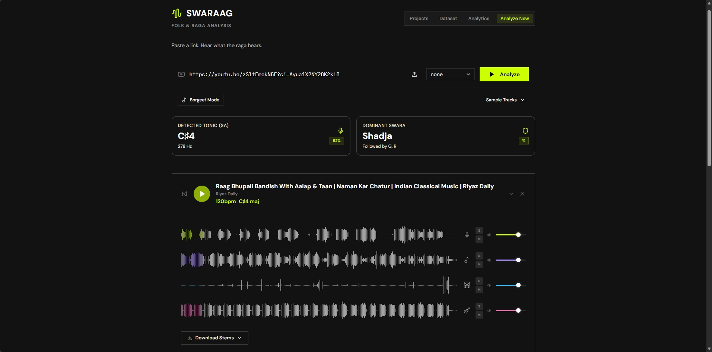
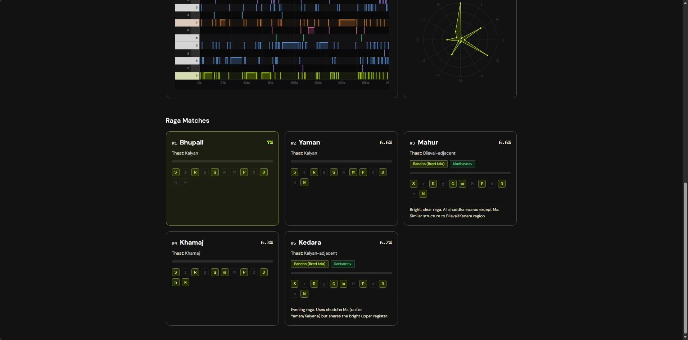
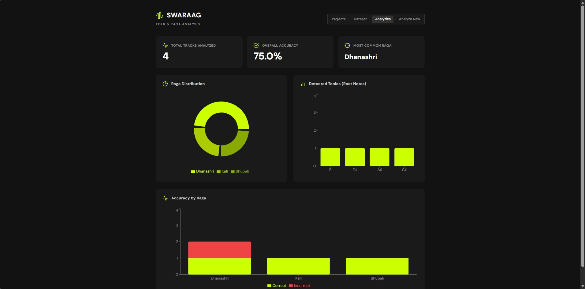
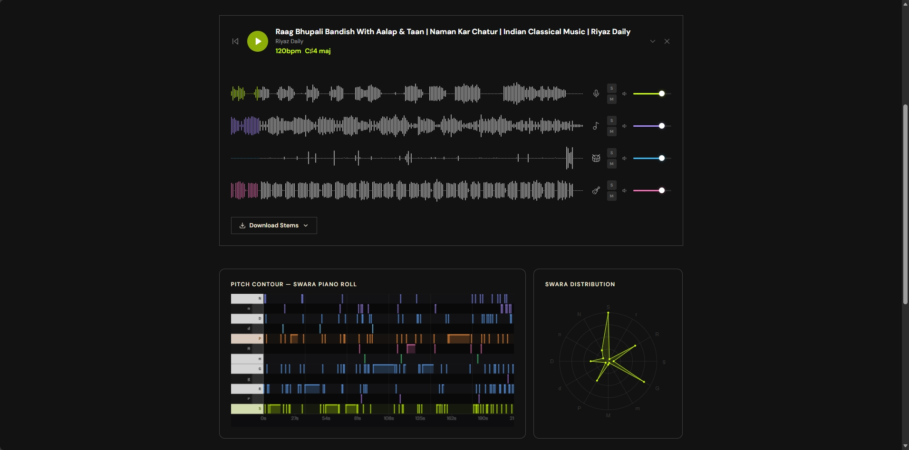
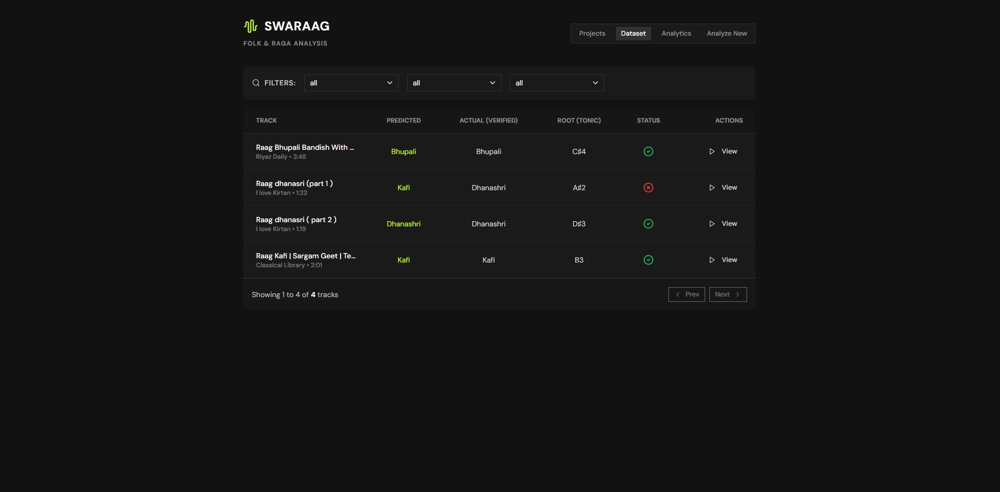

# 🎵 SWARAAG — Frontend Dashboard

<div align="center">
  
  <br/><br/>
  <p><b>The React (Vite) ethnomusicological dashboard for visualizing Indian Classical & Assamese Borgeet vocal music.</b></p>
</div>

---

## 📸 Dashboard Screens

### 🎛️ Interactive Analysis & Raga Prediction
Instantly analyze uploaded audio or YouTube links. View top raga matches with confidence scores, weighted by musicologically verified Vadi (dominant) and Samvadi (sub-dominant) anchors.
<div align="center">
  <br/>
  
  <br/>
</div>

<br/>

### ☸️ Radial Swara Wheel & Pitch Analytics
Indian pitch theory is inherently octave-circular. Swaraag's signature radial swara wheel maps 12-bin pitch histograms truthfully, highlighting prominent notes and microtonal inflections.
<div align="center">
  <br/>
  
  <br/>
</div>

<br/>

### 🎹 Melodic Contour & Piano Roll Visualization
Track fundamental frequency ($F_0$) transitions over time. Visualize vocal ornamentation (*Gamaka*, *Meend*) across traditional compositional movements (*Juroni*, *Uroni*, *Ghuroni*).
<div align="center">
  <br/>
  
  <br/>
</div>

<br/>

### 📚 Curated Borgeet Dataset & Repository
Explore a built-in, paginated dataset of traditional Borgeet recordings, complete with dynamic SQL filtering by predicted raga, actual raga, and verification status.
<div align="center">
  <br/>
  
  <br/>
</div>

---

## 🚀 Setup & Run

### 1. Install Dependencies
```bash
npm install
cp .env.example .env     # edit VITE_API_BASE if backend isn't on localhost:8000
```

### 2. Start Development Server
```bash
npm run dev
```
Opens at **`http://localhost:5173`**. Make sure the backend (`../backend`) is running first — the app calls it directly. If the backend is unreachable, the UI automatically falls back to generated demo data so you can still preview the layout and visualizations.

### 3. Build for Production
```bash
npm run build     # outputs to dist/
npm run preview   # serve the production build locally
```

---

## 🎨 Design System
- **Palette:** Dark bark/charcoal base (`#14110F`) with brass-gold (`#C89B3C`) and muted indigo (`#8FA0D0`) accents.
- **Typography:** Fraunces for display headings, IBM Plex Mono for swara labels (`S r R g G m M P d D n N`), and Inter for body text.
- **Visualization:** Recharts & custom SVG radial components engineered specifically for Indian Classical musicology.
